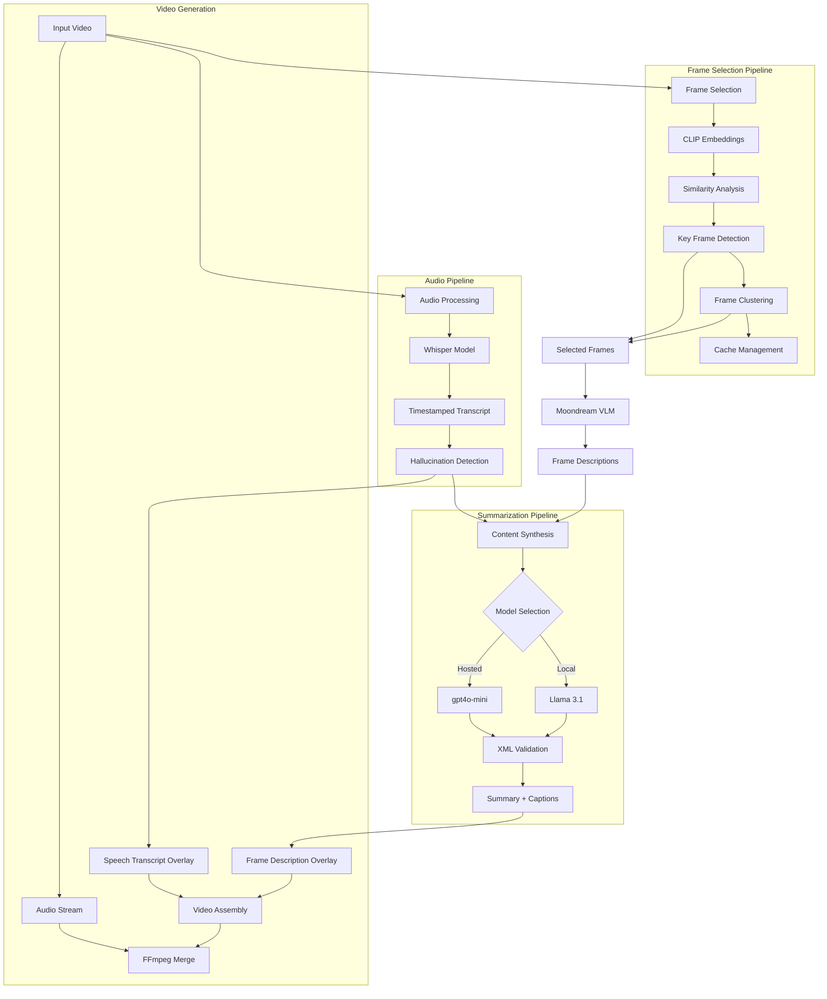
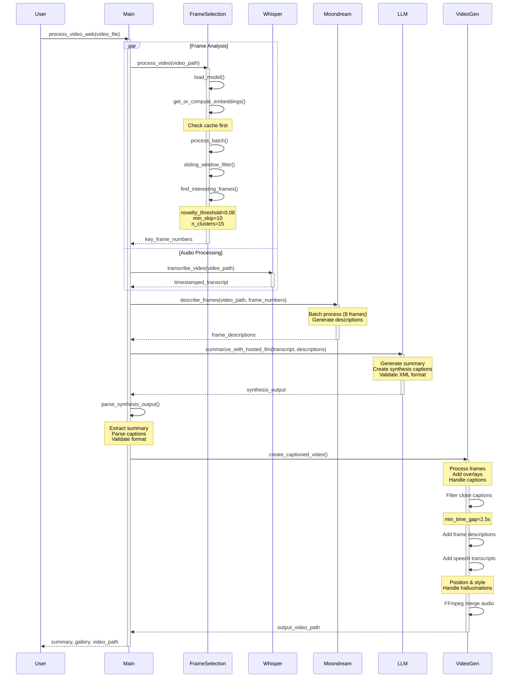

# Video Summarizer

A powerful video summarization tool that combines multiple AI models to provide comprehensive video understanding through audio transcription, intelligent frame selection, visual description, and content summarization.

## Quick Start
```bash
# Install and run with default settings
pip install -r requirements.txt
python main.py video.mp4

# Run with web interface (recommended)
python main.py --web

# Run with all features enabled
python main.py video.mp4 --frame-selection --save
```

## Features

### Core Features
- Intelligent frame selection using CLIP embeddings and clustering
- Audio transcription using Whisper
- Visual scene description using Moondream2
- Dynamic content synthesis with GPT-4o-mini/Llama
- Interactive web interface
- Accessible video output with captions

### Video Output Features
- 5-second summary intro with calculated reading duration
- Intelligent frame descriptions with timestamps
- Whisper-based speech transcription with hallucination detection
- Adaptive text wrapping and positioning
- Accessibility-focused caption design
- Choice between detailed or synthesized captions
- Original audio preservation with proper synchronization
- Black text backgrounds for enhanced readability

### Caption Types
1. **Full Frame Descriptions**
   - Detailed descriptions for every key frame
   - Technical visual details
   - More frequent updates
   - Timestamps included
   - 3px black background for readability
   
2. **Synthesis Captions** (Optional)
   - Context-aware, narrative-focused captions
   - Dynamic quantity based on video length
   - Automatic deduplication of close captions (< 1.2s apart)
   - Better for storytelling and overview
   - Clean text without timestamps
   - 3px black background for readability

### Accessibility Features
- High contrast caption backgrounds
  - 3px black background for all text
  - Tight background boxes that match text width
- Responsive font sizing
  - Frame descriptions: Standard size
  - Speech transcriptions: 40% larger
- Automatic text wrapping
- Minimum readable text size
- Caption persistence between transitions
- Clear timestamp indicators
- Separated visual and speech captions
  - Frame descriptions at top
  - Speech transcriptions centered at 15% from bottom
  - Tight background boxes for all text
- Original audio track preservation with proper delay for intro

### Video Generation
1. **Summary Intro**
   - 5-second black background intro
   - Centered summary text
   - Reading speed calculation (400 words/min)
   - Dynamic duration based on text length

2. **Main Video Content**
   - Frame descriptions with timestamps (if not using synthesis)
   - Synthesis captions (when selected)
   - Speech transcriptions with hallucination detection
   - Proper text positioning and styling
   - Black backgrounds for all text elements

3. **Audio Handling**
   - Original audio preservation
   - Proper audio delay for intro section
   - FFmpeg concat demuxer for clean transitions
   - Synchronized audio throughout video

4. **Technical Details**
   - FFmpeg for video assembly
   - PIL for text rendering
   - Proper character encoding support
   - Efficient text background rendering
   - Clean temporary file management

## Architecture Overview



## Process Sequence



## Directory Structure
```
video-summarizer/
├── main.py              # Main entry point
├── frame_selection.py   # CLIP-based frame selection
├── requirements.txt     # Dependencies
├── .env                # Environment variables
├── prompts/            # Model prompts
│   ├── moondream_prompt.md
│   └── synthesis_prompt.md
├── logs/               # Output logs
├── frame_analysis_plots/ # Frame analysis visualizations
└── embedding_cache/    # Cached CLIP embeddings
```

## Process Flow

1. **Video Input Processing**
   - Input: Video file
   - Output: Frame data and audio stream
   - Supported formats: MP4, AVI, MOV, MKV
   - Maximum recommended length: 30 minutes

2. **Frame Selection** (when using `--frame-selection`)
   - Model: CLIP (ViT-SO400M-14-SigLIP-384)
   - Process:
     1. Extract frames from video
     2. Generate CLIP embeddings for each frame (bfloat16 precision)
     3. Calculate frame similarities
     4. Detect novel frames using sliding window analysis (window_size=30)
     5. Cluster similar frames using KMeans (n_clusters=15)
     6. Select representative frames with stricter novelty threshold
   - Output: List of key frame numbers (~20% fewer than previous version)
   - Cache: Embeddings stored in `embedding_cache/<video_name>.npy`
   - Default mode: Samples every 50 frames when not using CLIP selection

3. **Audio Transcription**
   - Model: Whisper (large)
   - Process:
     1. Extract audio from video
     2. Generate transcript with timestamps
     3. Apply hallucination detection (words/second analysis)
   - Output: JSON with `{start, end, text}` segments
   - Supported languages: 100+ languages (auto-detected)
   - Accuracy: ~95% for clear English speech

4. **Frame Description**
   - Model: Moondream2 (vikhyatk/moondream2)
   - Input: Selected frames (either from CLIP selection or regular sampling)
   - Process:
     1. Batch process frames (8 at a time)
     2. Generate detailed descriptions
   - Output: Frame descriptions with timestamps
   - Batch size: Configurable (default: 8)
   - Memory usage: ~4GB GPU RAM

5. **Content Synthesis**
   - Models: 
     - Local: Meta-Llama-3.1-8B-Instruct
     - Hosted: gpt4o-mini
   - Input: 
     - Timestamped transcript
     - Frame descriptions
   - Output:
     - Comprehensive video summary
     - Dynamic number of synthesized captions (1/3 of keyframes)
   - Strict XML format with validation:
     - Summary section with 3-5 sentences
     - Exactly specified number of captions
     - Each caption with [X.X] timestamp format
     - Captions 20-50 words each
   - Error handling:
     - Validation of XML structure
     - Parsing verification
     - Fallback options on failure
   - Token limit: 4096 tokens
   - Temperature: 0.7

6. **Video Generation**
   - Format: MP4 with H.264 encoding
   - Components:
     - Frame descriptions at top of frame
       - Full descriptions or synthesized captions (user choice)
       - High-contrast background (70% opacity)
       - Timestamp indicators (for frame descriptions only)
       - Automatic deduplication of close captions
     - Speech transcriptions near bottom center
       - Centered text positioning
       - 15% margin from bottom
       - Larger font size (+4 sizes)
       - Individual background boxes per line
       - Hallucination filtering
       - Independent overlay from frame descriptions
   - Features:
     - Adaptive text sizing
     - Automatic line wrapping
     - High-contrast overlays
     - Responsive to video dimensions
     - Original audio preservation
     - Proper audio synchronization

7. **Gallery View** (Web Interface)
   - Always shows frame descriptions (not synthesis captions)
   - Includes frame numbers and timestamps
   - Used for debugging frame selection
   - Helps visualize key frame detection
   - Independent from video output format

## Installation

1. Clone the repository:
   ```bash
   git clone https://github.com/yourusername/video-summarizer.git
   cd video-summarizer
   ```

2. Create a virtual environment (recommended):
   ```bash
   python -m venv venv
   source venv/bin/activate  # Linux/Mac
   .\venv\Scripts\activate   # Windows
   ```

3. Install dependencies:
   ```bash
   pip install -r requirements.txt
   ```

4. Environment Setup:
   Create a `.env` file:
   ```
   OPENAI_API_KEY=your_api_key_here
   ```

## Usage

### Web Interface (Recommended)
```bash
python main.py --web
```

The web interface provides:
- Drag-and-drop video upload
- Progress tracking
- Interactive results viewing
- Download options for JSON output
- Caption style selection:
  - Full frame descriptions
  - Synthesized captions
- Frame selection toggle

### Command Line Interface

Basic usage:
```bash
python main.py <video_path>
```

Advanced options:
```bash
python main.py <video_path> [--save] [--local] [--frame-selection] [--web]
```

Options explained:
- `--save`: Save all outputs to JSON (includes transcript, descriptions, summary)
- `--local`: Use local Llama model instead of hosted LLM
- `--frame-selection`: Use CLIP-based intelligent frame selection
- `--web`: Launch web interface

Example commands:
```bash
# Process video with all features
python main.py video.mp4 --frame-selection --save

# Quick processing with hosted LLM
python main.py video.mp4 --save

# Launch web interface
python main.py --web
```

## Model Prompts

### Moondream Frame Description Prompt
Location: `prompts/moondream_prompt.md`
```
Describe this frame in detail, focusing on key visual elements, actions, and any text visible in the frame. Be specific but concise.
```

### Content Synthesis Prompt
Location: `prompts/synthesis_prompt.md`
```
You are a video content analyzer. Your task is to create a comprehensive summary of a video based on its transcript and frame descriptions.

The input will be provided in two sections:
<transcript>
Timestamped transcript of the video's audio
</transcript>

<frame_descriptions>
Timestamped descriptions of key frames from the video
</frame_descriptions>

Create a detailed summary that:
1. Captures the main topics and themes
2. Highlights key visual and auditory information
3. Maintains chronological flow
4. Integrates both visual and audio elements coherently

Be concise but comprehensive. Focus on the most important information.
```

## Output Format

When using `--save`, outputs are saved in `logs/` with the following structure:
```json
{
    "video_path": "path/to/video",
    "frame_count": 1000,
    "transcript": [
        {
            "start": 0.0,
            "end": 2.5,
            "text": "Transcribed text..."
        }
    ],
    "moondream_prompt": "Prompt used for frame description",
    "frame_descriptions": [
        {
            "frame_number": 100,
            "timestamp": 4.0,
            "description": "Frame description..."
        }
    ],
    "summary": "Final video summary...",
    "total_run_time": 120.5
}
```

## Frame Analysis Visualization

When using `--frame-selection`, analysis plots are saved in `frame_analysis_plots/` showing:
- Sequential frame similarities
- Sliding window differences
- Identified key frames
- Cluster representative frames

Plot interpretation:
- Blue line: Frame-to-frame similarity
- Orange line: Sliding window differences
- Red dots: Novel frames
- Green dots: Cluster representatives

## Requirements

- Python 3.10+
- CUDA-compatible GPU (recommended)
- Minimum 16GB RAM
- Storage:
  - ~10GB for models
  - Additional space for video processing
- FFmpeg (for video processing)
- Internet connection (for hosted LLM)

### Key Dependencies
- `torch`: GPU acceleration
- `whisper`: Audio transcription
- `transformers`: LLM models
- `open_clip`: Frame analysis
- `gradio`: Web interface
- `opencv-python`: Video processing
- `numpy`: Numerical operations
- `matplotlib`: Visualization
- See `requirements.txt` for complete list

## Performance Considerations

1. **Frame Selection**
   - CLIP embeddings are cached in `embedding_cache/`
   - First run on a video will be slower
   - Subsequent runs use cached embeddings
   - Cache format: NumPy arrays (.npy)
   - Cache size: ~2MB per minute of video

2. **Model Loading**
   - Models are loaded/unloaded to manage memory
   - GPU memory requirements:
     - Whisper: ~5GB
     - Moondream: ~4GB
     - Llama (if local): ~8GB
     - CLIP: ~2GB
   - Total peak memory: ~12GB (with local LLM)

3. **Processing Time**
   - Varies with video length and options
   - Example times (5-minute video):
     - Basic: ~5-10 minutes
     - With frame selection: ~15-20 minutes
     - With local LLM: ~25-30 minutes
   - Scaling: Approximately linear with video length

## Troubleshooting

1. **Out of Memory**
   - Reduce batch size in `describe_frames()`
   - Use hosted LLM instead of local
   - Process shorter video segments
   - Clear GPU memory: `torch.cuda.empty_cache()`
   - Monitor with `nvidia-smi`

2. **Slow Processing**
   - Check GPU utilization
   - Verify CUDA installation
   - Consider reducing frame sampling rate
   - Use CPU fallback if needed
   - Profile with `torch.profiler`

3. **Cache Issues**
   - Clear `embedding_cache/` if problems occur
   - Verify disk space availability
   - Check file permissions
   - Validate cache integrity

4. **Common Errors**
   - `CUDA out of memory`: Reduce batch size
   - `FFmpeg not found`: Install FFmpeg
   - `API rate limit`: Check API key and quotas
   - `File not found`: Check video path and permissions

## Video Output Format

The tool generates an MP4 video with the following structure:

1. **Intro Sequence (5 seconds)**
   - Black background
   - Centered, wrapped summary text
   - Larger font for readability

2. **Main Video Content**
   - Original video with overlay captions
   - Choice of caption styles:
     - Full frame descriptions
     - Synthesized narrative captions
   - Whisper transcriptions (when available)
   - Hallucination detection for transcript filtering

3. **Caption Formatting**
   - Semi-transparent black background (70% opacity)
   - White text with anti-aliasing
   - Automatic text wrapping
   - Responsive font sizing
   - Clear timestamp indicators
