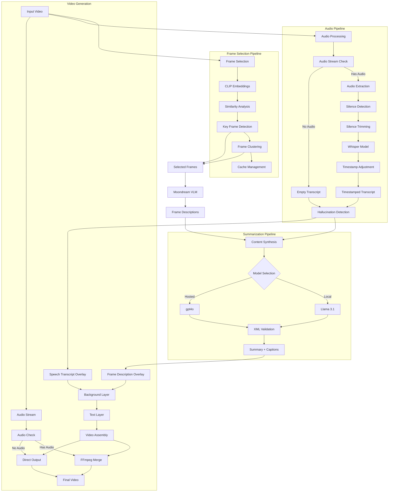
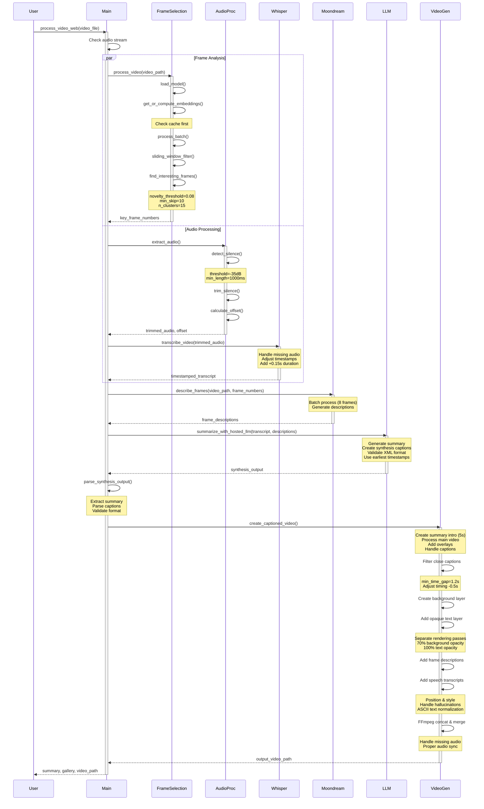

# Video Summarizer

> **⚠️ IMPORTANT:** This project uses Moondream2 (2025-01-09 release), CLIP, Llama 3.1 8B Instruct, and Whisper (large) via the Hugging Face Transformers library.

> **💡 NOTE:** This project offers two options for content synthesis:
> 1. OpenAI GPT-4o API (Default, recommended if you don't have access to LLama 3.1 8B Instruct yet)
> 2. Local Meta-Llama-3.1-8B-Instruct (Recommended if you want to run everything locally, requires requesting access to the model from Meta on Hugging Face repository [here](https://huggingface.co/meta-llama/Llama-3.1-8B-Instruct))
>
> **⚠️ AUTHENTICATION:** When using OpenAI, make sure to set your API key in the `.env` file with the key `OPENAI_API_KEY`.

## Table of Contents

- [Quick Start](#quick-start)
- [Features](#features)
  - [Core Features](#core-features)
  - [Video Output Features](#video-output-features)
  - [Caption Types](#caption-types)
  - [Accessibility Features](#accessibility-features)
  - [Content Synthesis Options](#content-synthesis-options)
- [Architecture Overview](#architecture-overview)
- [Process Sequence](#process-sequence)
- [Directory Structure](#directory-structure)
- [Process Flow](#process-flow)
- [Installation](#installation)
- [Usage](#usage)
  - [Web Interface](#web-interface-recommended)
  - [Command Line Interface](#command-line-interface)
  - [Local LLM Support](#local-llm-support)
- [Model Prompts](#model-prompts)
- [Output Format](#output-format)
- [Frame Analysis Visualization](#frame-analysis-visualization)
- [Requirements](#requirements)
- [Performance Considerations](#performance-considerations)
- [Troubleshooting](#troubleshooting)
- [Video Output Format](#video-output-format)
- [Recent Updates](#recent-updates)
  - [Audio Processing Improvements](#audio-processing-improvements)
  - [Caption Enhancements](#caption-enhancements)
  - [Technical Improvements](#technical-improvements)
- [Advanced Features & Limitations](#advanced-features--limitations)
  - [Hallucination Detection Parameters](#hallucination-detection-parameters)
  - [Transcript Cleaning System](#transcript-cleaning-system)
  - [Caption Timing Specifications](#caption-timing-specifications)
  - [Error Recovery System](#error-recovery-system)
  - [Resolution-based Adaptations](#resolution-based-adaptations)
  - [Video Processing Limitations](#video-processing-limitations)

A powerful video summarization tool that combines multiple AI models to provide comprehensive video understanding through audio transcription, intelligent frame selection, visual description, and content summarization.

## Quick Start

Reference [Installation](#installation) for more a detailed guide on how to install the dependencies (ffmpeg, pyvips, etc) and get things running.

```bash
# Install and run with default settings
pip install -r requirements.txt
python main.py video.mp4

# Run with web interface (recommended)
python main.py --web

# Run with all features enabled (including local LLM)
python main.py video.mp4 --frame-selection --local --save
```

## Features

### Core Features
- Intelligent frame selection using CLIP embeddings and clustering
- Audio transcription using Whisper
- Visual scene description using Moondream2
- Dynamic content synthesis with GPT-4o/Llama 3.1
- Interactive web interface
- Accessible video output with captions
- Local LLM support with Meta-Llama-3.1-8B-Instruct

### Video Output Features
- Intelligent frame descriptions with timestamps
- Whisper-based speech transcription with hallucination detection
- Adaptive text wrapping and positioning
- Accessibility-focused caption design
- Choice between detailed or synthesized captions
- Original audio preservation with proper synchronization

### Caption Types
1. **Full Frame Descriptions**
   - Detailed descriptions for every key frame
   - Technical visual details
   - More frequent updates
   - Timestamps included
   
2. **Synthesis Captions** (Highly recommended)
   - Context-aware, narrative-focused captions
   - Dynamic quantity based on video length
   - Automatic deduplication of close captions (< 2.5s apart)
   - Better for storytelling and overview
   - Clean text without timestamps

### Accessibility Features
- High contrast caption backgrounds (70% opacity)
- Responsive font sizing
  - Frame descriptions: Standard size
  - Speech transcriptions: 4 sizes larger
- Automatic text wrapping
- Minimum readable text size
- Caption persistence between transitions
- Clear timestamp indicators
- Separated visual and speech captions
  - Frame descriptions at top
  - Speech transcriptions centered near bottom
  - Tight background boxes for speech transcriptions
- Original audio track preservation

### Content Synthesis Options
1. **Hosted LLM (Default)**
   - Uses OpenAI's GPT-4o
   - Requires API key
   - Faster processing
   - Higher reliability

2. **Local LLM (New!)**
   - Uses Meta-Llama-3.1-8B-Instruct
   - No API key required
   - Full offline operation
   - Automatic fallback to hosted LLM
   - ~8GB GPU memory required
   - Compatible response format

## Architecture Overview



## Process Sequence



## Directory Structure
```
video-understanding-engine/
├── main.py              # Main entry point
├── frame_selection.py   # CLIP-based frame selection
├── requirements.txt     # Dependencies
├── .env                # Environment variables
├── prompts/            # Model prompts
│   ├── moondream_prompt.md
│   └── synthesis_prompt.md
├── logs/               # Output logs
├── frame_analysis_plots/ # Frame analysis visualizations
└── embedding_cache/    # Cached CLIP embeddings
```

## Process Flow

1. **Video Input Processing**
   - Input: Video file
   - Output: Frame data and audio stream
   - Supported formats: MP4, AVI, MOV, MKV
   - Maximum recommended length: 6-8 minutes
   - Automatic audio stream detection

2. **Frame Selection** (when using `--frame-selection`)
   - Model: CLIP (ViT-SO400M-14-SigLIP-384)
   - Process:
     1. Extract frames from video
     2. Generate CLIP embeddings for each frame (bfloat16 precision)
     3. Calculate frame similarities
     4. Detect novel frames using sliding window analysis (window_size=30)
     5. Cluster similar frames using KMeans (n_clusters=15)
     6. Select representative frames with stricter novelty threshold
   - Output: List of key frame numbers (~20% fewer than previous version)
   - Cache: Embeddings stored in `embedding_cache/<video_name>.npy`
   - Default mode: Samples every 50 frames when not using CLIP selection

3. **Audio Transcription**
   - Model: Whisper (large)
   - Process:
     1. Extract audio from video
     2. Generate transcript with timestamps
     3. Apply hallucination detection (words/second analysis)
   - Output: JSON with `{start, end, text}` segments
   - Supported languages: 100+ languages (auto-detected)
   - Accuracy: ~95% for clear English speech

4. **Frame Description**
   - Model: Moondream2 (vikhyatk/moondream2)
   - Input: Selected frames (either from CLIP selection or regular sampling)
   - Process:
     1. Batch process frames (8 at a time)
     2. Generate detailed descriptions
   - Output: Frame descriptions with timestamps
   - Batch size: Configurable (default: 8)
   - Memory usage: ~4GB GPU RAM

5. **Content Synthesis**
   - Models: 
     - Local (to be implemented): Meta-Llama-3.1-8B-Instruct
     - Hosted: gpt-4o
   - Input: 
     - Timestamped transcript
     - Frame descriptions
   - Output:
     - Comprehensive video summary
     - Dynamic number of synthesized captions:
       - Long videos (>2.5 min): 1/4 of keyframes
       - Short videos: 2/3 of keyframes (capped at 100)
   - Strict XML format with validation
   - Error handling with fallback to frame descriptions
   - Token limit: 4096 tokens
   - Temperature: 0.3

6. **Video Generation**
   - Input: Original video, descriptions, summary, transcript
   - Process:
     1. Create 5-second summary intro
     2. Process main video with captions
     3. Concatenate using FFmpeg
   - Features:
     - Predictive caption timing (0.5s early display)
     - Minimum 1.2s gap between captions
     - ASCII-compatible text rendering
     - Graceful handling of missing audio
     - Smart timestamp selection
     - Adaptive font scaling
     - High-contrast overlays
     - Centered transcript positioning
     - Individual background boxes
     - Automatic audio stream detection

7. **Recent Improvements**
   - Enhanced timing and synchronization:
     - Predictive caption timing with 0.5s early display
     - Smart timestamp selection using earliest scene detection
     - Minimum 1.2s gap between captions
     - Automatic audio stream detection
   - Visual enhancements:
     - Resolution-based font scaling (SD/HD/2K+)
     - Improved contrast with semi-transparent overlays (70% opacity)
     - Centered transcript text with individual boxes
     - Dynamic padding and margins based on resolution
   - Robustness improvements:
     - Graceful handling of missing audio streams
     - Fallback to frame descriptions if synthesis fails
     - Smart handling of caption timing edge cases
     - Comprehensive error handling
     - ASCII-compatible text normalization
   - Quality of life:
     - Automatic video property detection
     - Progress tracking
     - Debug logging
     - Informative status messages
     - Web-compatible output format (h264)

8. **Gallery View** (Web Interface)
   - Always shows frame descriptions (not synthesis captions)
   - Includes frame numbers and timestamps
   - Used for debugging frame selection
   - Helps visualize key frame detection
   - Independent from video output format

## Installation

### Initial Setup
1. Clone the repository:
   ```bash
   git clone https://github.com/yourusername/video-understanding-engine.git
   cd video-understanding-engine
   ```

2. Create a virtual environment (recommended):
   ```bash
   python -m venv venv
   source venv/bin/activate  # Linux/Mac
   .\venv\Scripts\activate   # Windows
   ```

### System Dependencies
```bash
# Linux/Ubuntu
sudo apt-get update
sudo apt-get install ffmpeg libvips libvips-dev

# macOS with Homebrew
brew install ffmpeg vips

# Windows
# 1. Download and install FFmpeg from https://ffmpeg.org/download.html
# 2. Download and install libvips from https://github.com/libvips/build-win64/releases
```

### Python Dependencies
```bash
pip install -r requirements.txt
```

### Moondream Setup
For detailed setup instructions and model information, visit [docs.moondream.ai/quick-start](https://docs.moondream.ai/quick-start). The Moondream model requires specific configurations and dependencies that are documented there.

### Environment Setup (if you want to use OpenAI API for frame synthesis)
Create a `.env` file:
```
OPENAI_API_KEY=your_api_key_here  # Only needed if not using local LLM
```

## Usage

### Web Interface (Recommended)
```bash
python main.py --web
```

The web interface provides:
- Drag-and-drop video upload
- Progress tracking
- Interactive results viewing
- Download options for JSON output
- Caption style selection:
  - Full frame descriptions
  - Synthesized captions
- Frame selection toggle

### Command Line Interface

Basic usage:
```bash
python main.py <video_path>
```

Advanced options:
```bash
python main.py <video_path> [--save] [--local] [--frame-selection] [--web] [--synthesis-captions]
```

Options explained:
- `--save`: Save all outputs to JSON (includes transcript, descriptions, summary)
- `--local`: (under development, not working yet) Use local Llama model instead of hosted LLM
- `--frame-selection`: Use CLIP-based intelligent frame selection
- `--web`: Launch web interface (highly recommended)
- `--synthesis-captions`: Use synthesized narrative captions (recommended for better viewing experience)

Example commands:
```bash
# Launch web interface (recommended for single video processing, easy to use)
python main.py --web

# Process single video with all features
python main.py video.mp4 --frame-selection --local --save --synthesis-captions

# Process all videos in a folder
python main.py /path/to/folder

# Process folder with all features
python main.py /path/to/folder --frame-selection --local --save --synthesis-captions

# Quick processing with hosted LLM and synthesis captions
python main.py video.mp4 --save --synthesis-captions
```

**Folder Processing Features:**
- Automatically processes all videos in the specified folder
- Supports common video formats (.mp4, .avi, .mov, .mkv, .webm)
- Shows progress (e.g., "Processing video 1/5")
- Retries up to 3 times if a video fails
- Uses exponential backoff between retries (5s, 10s, 15s)
- Continues to next video even if one fails
- Maintains consistent output structure in `outputs/` directory

### Local LLM Support
Now supports Meta-Llama-3.1-8B-Instruct for local content synthesis:
```bash
# Run with local LLM
python main.py video.mp4 --local

# Or enable in web interface
python main.py --web  # Then check "Use Local LLM" option
```

## Model Prompts

### Moondream Frame Description Prompt
Location: `prompts/moondream_prompt.md`
```
Describe this frame in detail, focusing on key visual elements, actions, and any text visible in the frame. Be specific but concise.
```

### Content Synthesis Prompt
Location: `prompts/synthesis_prompt.md`
```
You are a video content analyzer. Your task is to create a comprehensive summary of a video based on its transcript and frame descriptions.

The input will be provided in two sections:
<transcript>
Timestamped transcript of the video's audio
</transcript>

<frame_descriptions>
Timestamped descriptions of key frames from the video
</frame_descriptions>

Create a detailed summary that:
1. Captures the main topics and themes
2. Highlights key visual and auditory information
3. Maintains chronological flow
4. Integrates both visual and audio elements coherently

Be concise but comprehensive. Focus on the most important information.
```

## Output Format

When using `--save`, outputs are saved in `logs/` with the following structure:
```json
{
    "video_path": "path/to/video",
    "frame_count": 1000,
    "transcript": [
        {
            "start": 0.0,
            "end": 2.5,
            "text": "Transcribed text..."
        }
    ],
    "moondream_prompt": "Prompt used for frame description",
    "frame_descriptions": [
        {
            "frame_number": 100,
            "timestamp": 4.0,
            "description": "Frame description..."
        }
    ],
    "summary": "Final video summary...",
    "total_run_time": 120.5
}
```

## Frame Analysis Visualization

When using `--frame-selection`, analysis plots are saved in `frame_analysis_plots/` showing:
- Sequential frame similarities
- Sliding window differences
- Identified key frames
- Cluster representative frames

Plot interpretation:
- Blue line: Frame-to-frame similarity
- Orange line: Sliding window differences
- Red dots: Novel frames
- Green dots: Cluster representatives

## Requirements

- Python 3.10+
- CUDA-compatible GPU (recommended)
- Minimum 16GB RAM
- Storage:
  - ~10GB for models
  - Additional space for video processing
- FFmpeg (for video processing)
- Internet connection (for hosted LLM)

### Key Dependencies
- `torch`: GPU acceleration
- `whisper`: Audio transcription
- `transformers`: LLM models
- `open_clip`: Frame analysis
- `gradio`: Web interface
- `opencv-python`: Video processing
- `numpy`: Numerical operations
- `matplotlib`: Visualization
- See `requirements.txt` for complete list

## Performance Considerations

1. **Frame Selection**
   - CLIP embeddings are cached in `embedding_cache/`
   - First run on a video will be slower
   - Subsequent runs use cached embeddings
   - Cache format: NumPy arrays (.npy)
   - Cache size: ~2MB per minute of video

2. **Model Loading**
   - Models are loaded/unloaded to manage memory
   - GPU memory requirements:
     - Whisper: ~5GB
     - Moondream: ~4GB
     - Llama (if local): ~8GB
     - CLIP: ~2GB
   - Total peak memory: ~12GB (with local LLM)

3. **Processing Time**
   - Varies with video length and options
   - Example times (5-minute video):
     - Basic: ~5-10 minutes
     - With frame selection: ~15-20 minutes
     - With local LLM: ~25-30 minutes
   - Scaling: Approximately linear with video length

## Troubleshooting

1. **Out of Memory**
   - Reduce batch size in `describe_frames()`